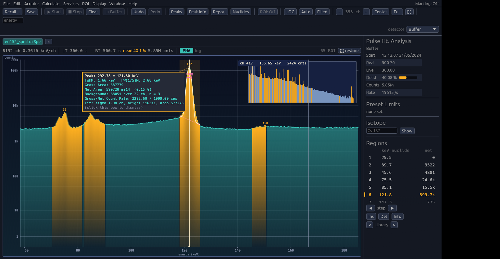
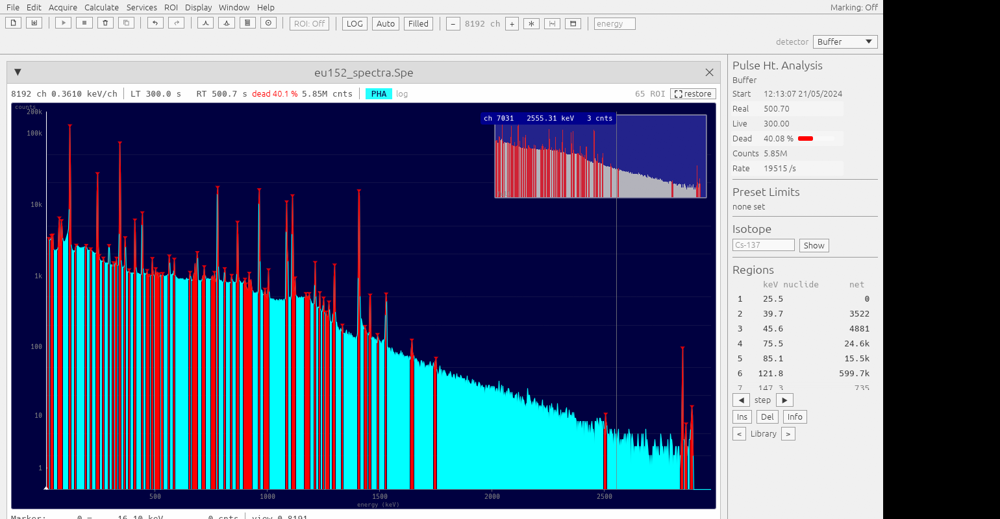
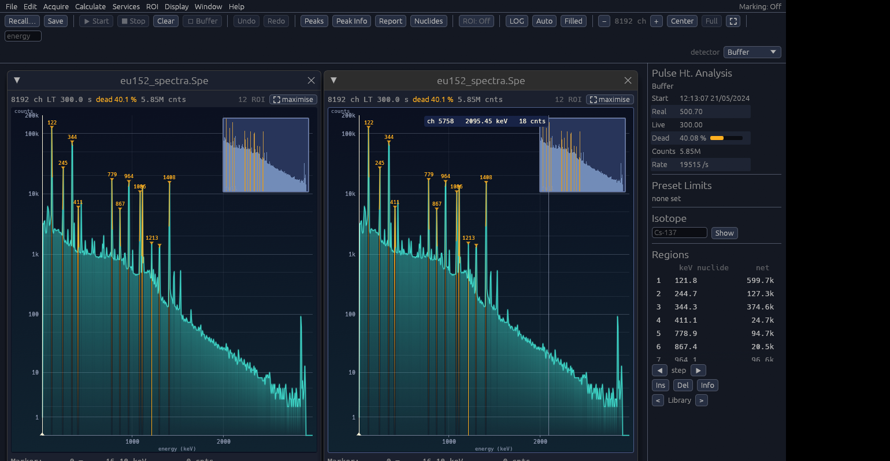
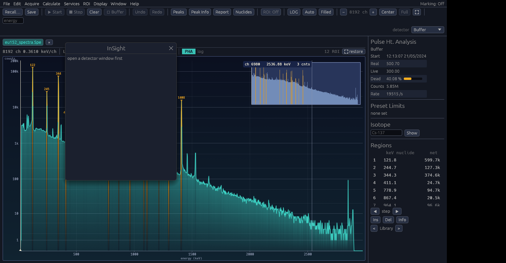
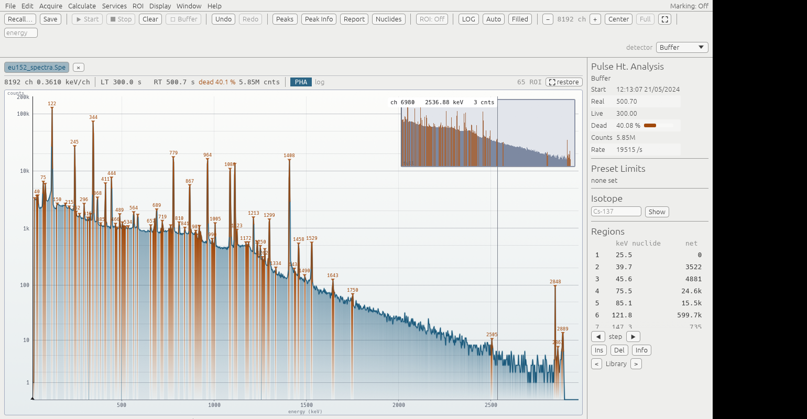

# Written with AI but it works I swear!

---

# MantaRay

[](https://github.com/gilder-m/MantaRay/actions/workflows/ci.yml)
[](LICENSE.md)
[](https://www.rust-lang.org)
[](#platforms)

A modern, open multichannel-analyzer (MCA) emulator and gamma-spectroscopy
workbench, written in Rust. It does what ORTEC's MAESTRO does - acquire, display,
calibrate, mark regions, search for peaks, report and automate - with a desktop
application, a command-line tool and libraries you can build on.



<details>
<summary>More screenshots: Conductor, tiled windows, the InSight oscilloscope, the Paper theme</summary>






</details>

```
mantaray/
├── crates/mantaray-core      spectrum model, calibration, peak analysis, libraries
├── crates/mantaray-formats   .Chn .Spc .Spe .Roi ASCII JSON list-mode codecs
├── crates/mantaray-device    instrument abstraction, presets, detector simulator
├── crates/mantaray-jobs      MAESTRO-compatible .JOB automation
├── crates/mantaray-report    ROI reports, nuclide reports, printouts
├── crates/mantaray-cli       the `mantaray` command-line workbench
└── crates/mantaray-gui       the desktop application
```

## What it does

**Acquisition.** Detectors are driven through one interface, so the built-in
physics simulator and a network instrument (an MCB served over TCP - another
MantaRay's simulator today, bench hardware speaking the same `SET_`/`SHOW_`
dialect tomorrow) behave the same: start, stop, clear, copy to buffer, list
mode, zero-dead-time modes, amplifier/ADC/bias/stabiliser settings and presets
on real time, live time, ROI peak, ROI integral, counting uncertainty and
minimum detectable activity - plus field-mode spectrum storage, the automatic
Optimize and pole-zero routines, and the InSight virtual oscilloscope.

**Display.** Two views per spectrum as MAESTRO has them - an expanded view and an
inset full view showing where you are - with a marker, rubber-band selection,
logarithmic, linear and automatic vertical scaling, baseline zoom, region
colouring, library-line markers and a comparison trace.

Spectra are arranged in **tabs** by default, one filling the working area, and
any of them can be pulled out into a window when two need to be watched at once.
**Workspaces** decide what the sidebar shows for the job in hand: Acquisition
puts the clock, the dead time and the preset that will stop the run in front of
you; Analysis puts the regions and the nuclide lookup there instead.

**Look.** A colour scheme is not only a palette - it carries how the program
draws: tabs or windows, words or icons on the toolbar, the fill under the trace,
gridlines, the background wash, the glow, shadows and corner rounding. Seven
schemes ship, including one measured from the software these instruments have
traditionally been driven with. Every colour is editable, the contrast of each
against the plot is reported as you edit, and a scheme is saved as a small JSON
file you can send somebody. See [docs/themes.md](docs/themes.md).

**Naming a nuclide.** Type `Cs-137`, `137Cs`, `cs137` or `Cs 137` into the
sidebar and its lines are drawn over the spectrum, each labelled with its
emission probability, above an intensity cutoff you choose. When it is not
found, the reason says which kind of not-found it is: no library loaded, not in
this library, or not a nuclide name.

**Analysis.** Peak information (gross, adjusted gross, background, net and its
uncertainty, centroid, FWHM, FW(1/x)M), a multi-scale Mariscotti peak search,
five-point binomial smoothing, spectrum stripping, energy and peak-shape
calibration, nuclide identification against an editable library, efficiency
calibration, activities with decay correction, detection limits, and
quality-assurance control charts.

**Automation.** `.JOB` files run with MAESTRO's command set, variables and loop
counters, either from the desktop application (a few commands per frame, so the
display keeps up) or headless from the command line.

**Undo.** Every command that changes or discards data - Clear, Smooth, Strip,
region edits, peak marking - can be taken back with Ctrl+Z. Instrument memory is
never written back to: undoing a detector command recovers the data into a buffer
window, exactly as recalling a file does.

## Installing

Built archives for **Linux** and **Windows** are attached to each
[release](https://github.com/gilder-m/MantaRay/releases), together with a
`SHA256SUMS.txt` covering them. Check a download against what the release
workflow actually built:

```sh
sha256sum -c SHA256SUMS.txt              # Linux
```
```powershell
Get-FileHash MantaRay-windows-x86_64.zip -Algorithm SHA256   # Windows
```

Each archive holds the desktop application, the `mantaray` command-line tool and
the `mantaray-mcb` helper that reaches instruments. Keep the three together: the
application looks for the helper beside itself.

macOS is **coming soon** - it builds and passes its tests in CI, but nothing has
run there against an instrument yet, so no binary is published.

## Building and running

Rust 1.92 or newer.

```sh
cargo run -p mantaray-gui                      # the desktop application
cargo run -p mantaray-gui -- spectrum.Spe      # open a file, or run a .JOB
cargo run -p mantaray-cli -- --help            # the command-line workbench
cargo run -p mantaray-cli -- serve             # a simulator as a network MCB
cargo test                                    # the whole test suite
```

### Linux

The desktop application needs the usual windowing and GL libraries. On Ubuntu or
Debian:

```sh
sudo apt install build-essential pkg-config libgtk-3-dev \
    libxkbcommon-dev libwayland-dev libxcb1-dev libx11-dev libgl1-mesa-dev
```

`libgtk-3-dev` is only needed for native file dialogs. Without it, build with

```sh
cargo run -p mantaray-gui --no-default-features
```

and use **File / Open path...** to type a path instead. The libraries and the
command-line tool have no system dependencies at all.

To drive a local ORTEC instrument over USB, build the helper that sits beside
the application - `cargo build -p mantaray-mcb` - and grant the adapter to your
user once:

```sh
echo 'SUBSYSTEM=="usb", ATTR{idVendor}=="0a2d", ATTR{idProduct}=="0016", TAG+="uaccess", MODE="0660"' \
    | sudo tee /etc/udev/rules.d/70-ortec-dpm-usb.rules
sudo udevadm control --reload-rules && sudo udevadm trigger
```

then replug the adapter and press **Scan** on the opening screen. No driver is
needed; see [docs/ortec-hardware.md](docs/ortec-hardware.md).

### Windows and macOS

`cargo run -p mantaray-gui` is enough; no extra packages.

## The command-line workbench

```sh
mantaray info spectrum.Spe                      # what is in a file
mantaray convert in.Spe out.chn                 # between any supported formats
mantaray peaks spectrum.Spe --sensitivity 2     # find and identify peaks
mantaray report spectrum.Spe --column           # MAESTRO-style ROI report
mantaray analyse soil.Spe --efficiency 0.05 \
        --quantity 1.2 --unit kg --mda         # activities and detection limits
mantaray calibrate raw.chn --point 1788=661.657 --point 3646=1332.492 -o cal.chn
mantaray calibrate raw.Spe --auto Eu-152 -o cal.Spe  # find, match and fit automatically
mantaray print spectrum.Spe --from 600 --to 700 # channel dump, seven to a line
mantaray job nightly.job --trace                # run an automation script
mantaray job nightly.job --detector 192.168.0.40:2000   # run against an instrument
```

## File formats

| Format | Read | Write | Notes |
|---|---|---|---|
| `.Chn` | yes | yes | ORTEC integer binary, including the calibration trailer |
| `.Spc` | yes | yes | ORTEC binary; the record map is followed from the header pointers |
| `.Spe` | yes | yes | IAEA/CTBTO ASCII, with `$ROI`, `$MCA_CAL` and `$SHAPE_CAL` |
| `.Roi` | yes | yes | region tables |
| `.txt`, `.asc` | yes | yes | ASCII dumps, with TRANSLT's column options |
| `.json` | yes | yes | MantaRay's own lossless format |
| `.Lis` | yes | yes | list-mode events, with time slicing |
| `.n42` | yes | - | ANSI N42.42 XML, both the 2005 and 2011 revisions |
| `.csv` | - | yes | channels or analysis results, for spreadsheets |

See [docs/formats.md](docs/formats.md) for the layouts, including how the `.Spc`
record map was verified.

## The whole manual runs

Every feature in the MAESTRO v7 manual is implemented or deliberately improved -
[docs/maestro-parity.md](docs/maestro-parity.md) is the section-by-section
accounting, including what is different and why. The last pieces to land were
window tiling and cascade, the unsaved-changes question, Download Spectra and
field-mode instrument storage, the Optimize and pole-zero routines with an
InSight virtual oscilloscope on the simulated preamplifier, printing with the
plot and reports on one page, and the complete §6.5 JOB command set - including
`RUN`/`WAIT "program"` launching real programs, `LOOP SPECTRA`/`VIEW` walking
the instrument's stored spectra, and `ZOOM` placing windows.

**Real hardware works, with none of ORTEC's software.** MantaRay drives an ORTEC
926 over USB using only the kernel driver - no `Mcbcio32.dll`, no `mcbloc32.dll`,
no `DpmUsbAddIn.dll`, no MAESTRO installed. It finds the instruments, numbers
them itself, and reads whole spectra: all 8192 channels identical to what
ORTEC's own library reads from the same detector, clocks matching to the
millisecond, and the channel sums agreeing with the instrument's own arithmetic.
A spectrum takes about a sixteenth of a second.

On Linux not even the kernel driver is ORTEC's: the same instrument is reached
over libusb with no vendor software of any kind, and a one-line udev rule is
the whole installation. Verified against a real 926 - Scan and Open all in the
desktop application, and the full spectrum readout - on 2026-08-05.

Instruments are reached through a transport carrying one ASCII dialect, so a
socket and a local instrument are the same code above the seam. See
[docs/ortec-hardware.md](docs/ortec-hardware.md), which records the wire format
and marks what is verified and what is not.

## Checked against real data

The readers and the analysis are tested against genuine instrument files, not
only ones invented to pass. Drop real spectra into
`crates/mantaray-formats/tests/fixtures/` and the suite will exercise them: every
file must load, round-trip through the native format, and - for recognised
sources - show the expected lines at the expected energies. On a real Cs-137
spectrum from a MAESTRO Pro system, MantaRay reports the 661.657 keV line at
661.98 keV with a 1.80 keV FWHM and a net area of 1 286 255 ± 1 185 (0.09 %).

`cargo test --workspace` runs everything.
[docs/testing.md](docs/testing.md) says what each suite holds to account, and -
more usefully - what the tests **cannot** cover.

## Platforms

| | builds | tests | hardware |
|---|---|---|---|
| **Linux** | yes | yes | yes - USB over libusb, with no vendor driver at all |
| **Windows** | yes | yes | yes - USB, with only ORTEC's kernel driver |
| macOS | yes | yes | never run against an instrument |

Linux and Windows are released. macOS is built and tested by CI on every push
and is deliberately **not** released: nothing has been run there against real
hardware, and an untested binary for a platform nobody has used is a promise
this project cannot keep.

A few suites are about Windows itself - file-type registration, the crash
report, the bridge to ORTEC's library - and are skipped elsewhere.

## Documentation

- [docs/maestro-parity.md](docs/maestro-parity.md) - every feature in the MAESTRO
  manual, where it lives here, and what is deliberately different
- [docs/formats.md](docs/formats.md) - file format details
- [docs/architecture.md](docs/architecture.md) - how the crates fit together
- [docs/nuclide-data.md](docs/nuclide-data.md) - why no nuclide library ships, and
  how to bring or build one
- [docs/themes.md](docs/themes.md) - the rules a palette has to satisfy, the
  scheme file, workspaces, and where Conductor's colours were measured from
- [docs/testing.md](docs/testing.md) - what each test suite holds to account,
  and what the tests cannot cover

## Acknowledgements

**Nuclear data.** No nuclide library ships with this project, deliberately: line
energies and emission probabilities belong to whoever evaluated them, and a
table with no evaluation, no date and nothing to cite is worse than no table at
all, because a result computed from it cannot be defended. Bring a `.Lib` file,
or build a library from an evaluated export with `mantaray library` - see
[docs/nuclide-data.md](docs/nuclide-data.md). Those sources, and the people who
make them reachable:

- the **National Nuclear Data Center** at Brookhaven National Laboratory, for
  NuDat and the ENSDF evaluations underneath it;
- the **IAEA Nuclear Data Services**, whose Live Chart of Nuclides API serves the
  same evaluations in machine-readable form;
- **[carsus](https://github.com/tardis-sn/carsus)**, from the TARDIS project,
  which retrieves and caches the NNDC tables;
- **Dani Solakian** and the Berkeley **[RadWatch](https://github.com/RadWatch)**
  `spectral-analysis` project, whose compiled NNDC gamma database MantaRay's
  library builder is designed around, used here with permission.

**Standing on.** [egui and eframe](https://github.com/emilk/egui) for the
interface, [nusb](https://github.com/kevinmehall/nusb) for USB without a vendor
driver, and the Rust project for the rest.

## Licence

[PolyForm Noncommercial 1.0.0](LICENSE.md). Fork it, change it, build on it and
share it however you like **for any noncommercial purpose** - your own use,
study, research, teaching, hobby work. Charities, schools, universities, public
research bodies and government institutions count as noncommercial too, however
they are funded. What the licence does not grant is the right to sell it or use
it commercially; for that, ask.

Note that this is a source-available licence, not an OSI-approved open-source
one, precisely because it withholds commercial use.

MantaRay is an independent implementation. It is not affiliated with, endorsed by
or derived from the source code of ORTEC or AMETEK, and MAESTRO is their
trademark. Behaviour was reproduced from the published user manual and from
public file-format descriptions.

## How this was built

The initial version of MantaRay was vibe-coded: written largely by a large
language model working from the MAESTRO manual, under human direction, rather
than typed line by line. That is stated plainly because it should change how you
read the code and how much you trust it before checking it yourself.

What that does **not** mean is that it is unverified. The behaviour is pinned by
an automated suite that runs on every push, the file readers are checked against
genuine ORTEC files, and the hardware path was validated against a real ORTEC
926 - the in-house USB readout returns all 8192 channels identically to ORTEC's
own library, with the clocks matching to the millisecond. Where something could
not be confirmed, it is marked unverified in the documentation rather than
quietly assumed: [docs/testing.md](docs/testing.md) ends with what the tests
cannot cover, and several formats are left unimplemented for the same reason.

What it does mean is the ordinary caution owed to any young instrument
program: this is alpha software, it has not had a long shakedown across many
machines and detectors, and nobody should stake a measurement that matters on
it without checking the result against something already trusted. Bug reports
are welcome, and so is a careful reading of the parts you intend to rely on.
